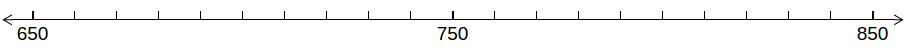
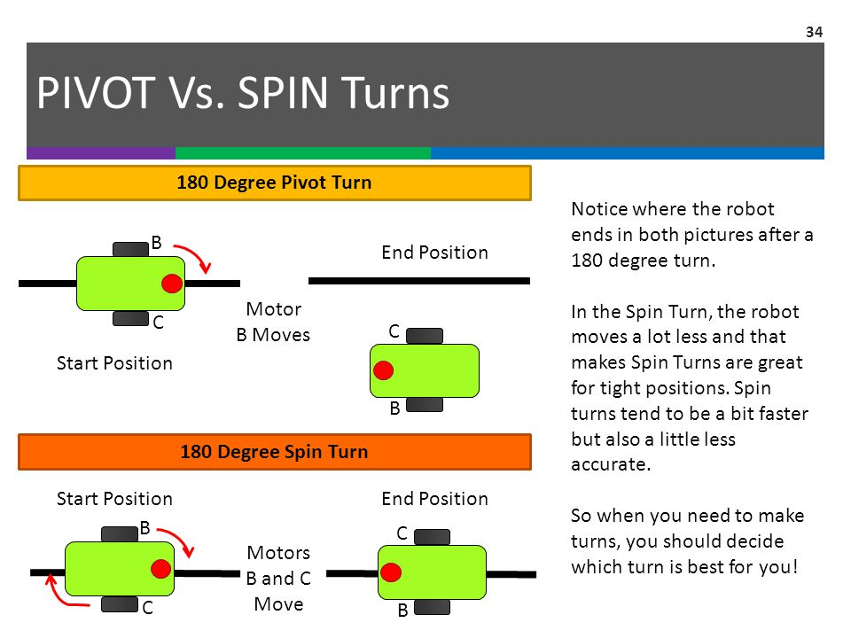

.. highlight:: basic
   :linenothreshold: 3

Movement
********

Moving the wheels of the robot is fairly simple. We will use the **PULSOUT** keyword
to send a signal to the wheels to turn. Each wheel has a unique ID and takes in a range
of "power values" for how fast the wheel spins and in what direction.

=====   ==  ===========
Wheel   ID  Power Value
=====   ==  ===========
Right   12  650 <=> 850
Left    13  650 <=> 850
=====   ==  ===========

The power values dictate how fast the wheel spins in a certain direction.
Think of a number line where 650 and 850 are at the ends and 750 is the center.

Consider 750 to be the neutral value. This means if you set a wheel to a value of
750 it shouldnt move.

If you set a wheel to either 650 or 850 then it will move at full power in a certain direction.

=========== =========
Power Value Direction
=========== =========
650         Clockwise
750         None
850         Counter-Clockwise
=========== =========

Moving Forward
==============

In order to move the robot forward we need to spin each wheel either counter-clockwise
or clockwise but not the same. Running this code below will make the wheels move
in a very short burst.
::
    PULSOUT 13, 850
    PULSOUT 12, 650

To continuously go forwards for a small time we program it like so:
::
    i   VAR     WORD

    FOR i=1 TO 100
        PULSOUT 13, 850
        PULSOUT 12, 650
    NEXT

Moving Backwards
================

We have the same idea as moving forwards except the values are flipped.
::
        PULSOUT 13, 650
        PULSOUT 12, 850

And again to continuously go backwards for a small time we program it like so:
::
    i   VAR     WORD

    FOR i=1 TO 100
        PULSOUT 13, 650
        PULSOUT 12, 850
    NEXT

Turning
=======

There are 2 approaches to turning your robot.

1. Pivot Turn
2. Spin Turn

This diagram helps to explain the key differences:

Ultimately what type of turns you want to perform is up to you. Just make sure you're
consistent with the type of turns you perform.

Pivot Turn
----------

Depending on the wheel you want to pivot about influences what code to use.

Pivot about Left Wheel:
::
    i   VAR     WORD

    FOR i=1 TO 100
        PULSOUT 12, 650
    NEXT

Pivot about Right Wheel:
::
    i   VAR     WORD

    FOR i=1 TO 100
        PULSOUT 13, 650
    NEXT

Spin Turn
----------

Spin turns move both wheels in the same direction either clockwise or counter-clockwise.

Spinning in Clockwise direction:
::
    i   VAR     WORD

    FOR i=1 TO 100
      PULSOUT 13, 650
      PULSOUT 12, 650
    NEXT

Spinning in Counter-Clockwise direction:
::
    i   VAR     WORD

    FOR i=1 TO 100
      PULSOUT 13, 850
      PULSOUT 12, 850
    NEXT

Practice
========

I'd like to challenge you to program your robot to move forward, spin in some direction,
and then backup with what you've learned so far. In addition, you should try to practice
more by programming your own little movement sequence.
