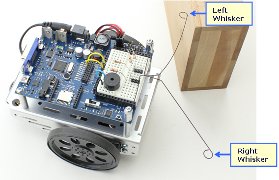

.. highlight:: basic
   :linenothreshold: 3

Whiskers
********

Whiskers are one of the components included in the robot kit. Whisker sensors allow
the robot to detect obstacles when it bumps into them.

Whisker values are accessed via **IN5** and **IN7**

=====  =======
IN id  Whisker
=====  =======
IN5    Left Whisker
IN7    Right Whisker
=====  =======

=============   =====
Whisker State   Value
=============   =====
Unpressed       1
Pressed         0
=============   =====

Example: Outputting values when pressed
=======================================
::

        left_whisker    VAR     Bit
        right_whisker   VAR     Bit

        Main:
            DO
                left_whisker = IN5
                right_whisker = IN7

                IF (left_whisker = 0) AND (right_whisker = 0) THEN
                    DEBUG "Both Whiskers were pressed!"
                ELSEIF (left_whisker = 0) THEN
                    DEBUG "Left Whisker was pressed!"
                ELSEIF (right_whisker = 0) THEN
                    DEBUG "Right Whisker was pressed!"
                ELSE
                    DEBUG "No Whiskers are pressed..."
                ENDIF
            LOOP

Example: Utilizing the whiskers
===============================
::

        left_whisker    VAR     Bit
        right_whisker   VAR     Bit
        pulse_count     VAR     Byte

        Main:
            left_whisker = IN5
            right_whisker = IN7

            DO
                IF (left_whisker = 0) AND (right_whisker = 0) THEN
                    ' Left and Right whiskers are pressed so we back up and make a U-turn by default
                    ' A U-turn is just 2 left turns
                    GOSUB Back_Up
                    GOSUB Spin_Turn_Left
                    GOSUB Spin_Turn_Left
                ELSEIF (left_whisker = 0) THEN
                    GOSUB Back_Up
                    GOSUB Spin_Turn_Right
                ELSEIF (right_whisker = 0) THEN
                    GOSUB Back_Up
                    GOSUB Spin_Turn_Left
                ELSE
                    ' here the whiskers are NOT in contact with a wall so we pulse forward
                    GOSUB Pulse_Forward
                ENDIF
            LOOP

        Pulse_Forward:
            PULSOUT 13,850
            PULSOUT 12,650
        RETURN

        Spin_Turn_Left:
            FOR pulse_count = 0 TO 50
                PULSOUT 13, 650
                PULSOUT 12, 650
            NEXT
        RETURN

        Spin_Turn_Right:
            FOR pulse_count = 0 TO 50
                PULSOUT 13, 850
                PULSOUT 12, 850
            NEXT
        RETURN

        Back_Up:
            FOR pulse_count = 0 TO 50
                PULSOUT 13, 650
                PULSOUT 12, 850
            NEXT
        RETURN

Conclusion
==========

Whiskers are a good way to detect obstacles in front of the robot. However, whiskers
aren't the best way to detect obstacles. There are some quirks of the whiskers bending
in weird ways and which makes them less reliable. In the next section we will cover
Infrared Sensors which offer much more in terms of depth perception and field
of view (fov).
